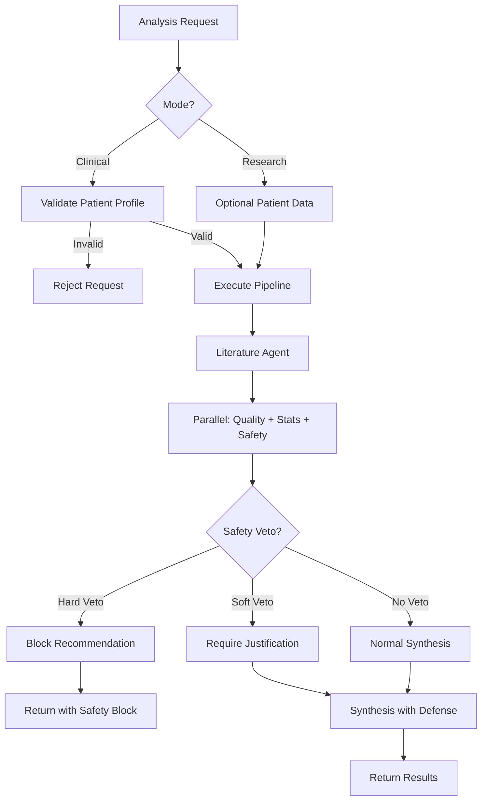
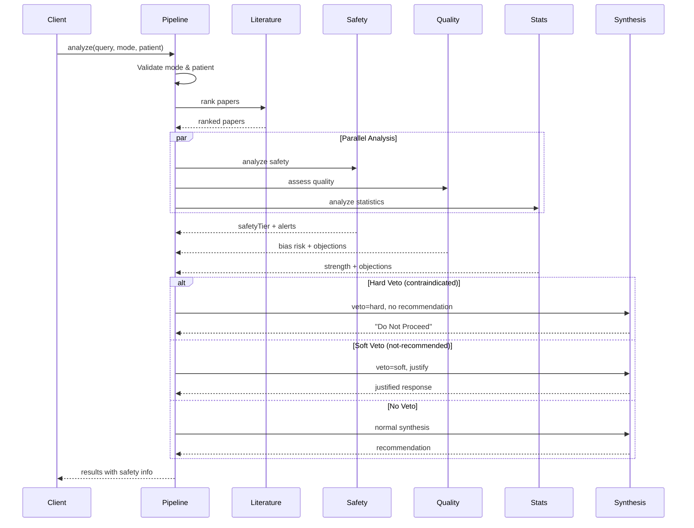

# Design Document: Safety-First Clinical Mode

## Overview

This design transforms MedSight from a research summarization tool into a safety-first clinical decision support system called "Clinician's Shield". The transformation introduces a dual-mode architecture (clinical and research), mandatory patient profiling in clinical mode, contraindication detection, agent veto logic, and safety-first UI presentation.

### Core Design Principles

1. **Safety First**: Patient safety takes absolute priority over recommendation confidence or completeness
2. **Explicit Uncertainty**: All sources of uncertainty, bias, and disagreement must be surfaced explicitly
3. **Veto Authority**: Safety agents can block unsafe recommendations; synthesis cannot override safety vetoes
4. **Justified Recommendations**: Every recommendation must address all objections and safety concerns
5. **Transparency**: Show all evidence, conflicts, and reasoning to clinicians
6. **Backwards Compatibility**: Research mode preserves existing exploratory analysis capabilities

### Architectural Changes

The system introduces three major architectural changes:

1. **Mode-Based Execution**: Analysis pipeline branches based on "clinical" or "research" mode
2. **Safety-First Agent Pipeline**: PatientSafetyAgent (upgraded from PatientMatchAgent) runs before synthesis with veto authority
3. **Critique and Defense System**: Agents generate objections; SynthesisAgent must respond to each objection

## Architecture

### System Modes




**Clinical Mode**:
- Requires complete PatientProfile (age, sex, primaryCondition)
- Enforces safety analysis with veto capability
- Blocks unsafe recommendations (hard veto)
- Requires justification for concerning recommendations (soft veto)
- Displays safety information prominently

**Research Mode**:
- Accepts optional patient data
- Provides informational warnings
- Does not block recommendations
- Maintains backwards compatibility with existing usage

### Agent Pipeline Architecture




The pipeline executes in stages:
1. **Validation**: Check mode and patient profile completeness
2. **Literature Ranking**: Identify relevant papers (unchanged)
3. **Parallel Analysis**: Run Safety, Quality, and Statistics agents concurrently
4. **Veto Check**: Determine if safety concerns trigger veto
5. **Synthesis with Defense**: Generate recommendation or safety block

### Veto Logic


**Hard Veto** (SafetyTier = "contraindicated"):
- Triggered when explicit contraindications match patient
- Blocks recommendation generation completely
- SynthesisAgent outputs "Do Not Proceed" with safety reasoning
- UI displays prominent red warning, hides recommendation section

**Soft Veto** (SafetyTier = "not-recommended"):
- Triggered when significant demographic gaps or concerning patterns exist
- Allows recommendation but requires explicit justification
- SynthesisAgent must address why evidence might still apply
- UI displays orange warning, shows recommendation with caution

**No Veto** (SafetyTier = "caution" or "safe"):
- Normal synthesis proceeds
- Safety information displayed informationally
- Recommendations shown normally with appropriate confidence

## Components and Interfaces

### 1. Mode Validation Component

**Location**: `backend/analyzePipeline.ts`

**Responsibility**: Validate analysis mode and patient profile requirements

**Interface**:
```typescript
function validateRequest(
  mode: AnalysisMode,
  patient?: PatientProfile
): { valid: boolean; error?: string }
```

**Logic**:
- If mode === "clinical" and patient is missing or incomplete → return error
- If mode === "research" → always valid
- Validate patient fields: age (number), sex (string), primaryCondition (string)

### 2. PatientSafetyAgent

**Location**: `backend/agents/patientSafetyAgent.ts` (renamed from patientMatchAgent.ts)

**Responsibility**: Scan literature for contraindications, exclusions, and demographic gaps

**Interface**:
```typescript
async function patientSafetyAgent(
  papers: NormalizedPaper[],
  query: string,
  patient: PatientProfile,
  mode: AnalysisMode
): Promise<PatientSafetyAgentOutput>
```

**Algorithm**:

1. **Extract Study Characteristics**: Parse abstracts for age ranges, sex distribution, exclusion criteria, comorbidity mentions
2. **Match Contraindications**: 
   - Check if patient age falls in explicit exclusion ranges
   - Check if patient sex is excluded
   - Check if patient comorbidities match exclusion criteria
   - Check if patient medications contraindicate intervention
3. **Assess Demographic Gaps**:
   - Calculate age difference between patient and study populations
   - Calculate sex representation in studies
   - Identify missing comorbidity representation
4. **Classify Safety Tier**:
   - If explicit contraindications found → "contraindicated"
   - If severe demographic gaps (age >20 years, sex <20% representation) → "not-recommended"
   - If moderate gaps (age 10-20 years, sex 20-40% representation) → "caution"
   - Otherwise → "safe"
5. **Generate Outputs**:
   - Clinical alerts for each contraindication/concern
   - Exclusion matches with citations
   - Demographic gap descriptions
   - Alternative options (if available in literature)
   - Plain-language summary
   - Questions for clinician

**LLM Integration**: Use Gemini to analyze abstracts for exclusion criteria and contraindications with structured JSON output

### 3. Veto Coordinator

**Location**: `backend/analyzePipeline.ts`

**Responsibility**: Collect agent objections and determine veto status

**Interface**:
```typescript
interface VetoStatus {
  type: 'none' | 'soft' | 'hard';
  reason: string;
  objections: Objection[];
}

interface Objection {
  source: 'safety' | 'quality' | 'statistics';
  severity: 'info' | 'warning' | 'critical';
  message: string;
}

function determineVeto(
  safetyOutput: PatientSafetyAgentOutput,
  qualityOutput: TrialQualityAgentOutput,
  statsOutput: StatisticsAgentOutput
): VetoStatus
```

**Logic**:

- If safetyTier === "contraindicated" → hard veto
- If safetyTier === "not-recommended" → soft veto
- Collect objections from quality agent (high bias risk)
- Collect objections from statistics agent (weak evidence)
- Pass all objections to synthesis agent

### 4. Enhanced SynthesisAgent

**Location**: `backend/agents/synthesisAgent.ts`

**Responsibility**: Generate recommendations while addressing all objections

**Interface**:
```typescript
async function synthesisAgent(
  query: string,
  papers: NormalizedPaper[],
  literature: LiteratureAgentOutput,
  trialQuality: TrialQualityAgentOutput,
  statistics: StatisticsAgentOutput,
  patientSafety: PatientSafetyAgentOutput,
  vetoStatus: VetoStatus
): Promise<SynthesisAgentOutput>
```

**Algorithm**:
1. **Check Veto Status**:
   - If hard veto → return "Do Not Proceed" with safety reasoning
   - If soft veto → proceed but require justification
2. **Collect Evidence**:
   - Supporting evidence (high quality studies, strong statistics, good patient match)
   - Contradicting evidence (conflicts between studies, weak statistics)
   - Safety objections (from PatientSafetyAgent)
   - Quality objections (from TrialQualityAgent)
   - Statistical objections (from StatisticsAgent)
3. **Generate Recommendation**:
   - Use LLM to synthesize evidence
   - Explicitly address each objection
   - Justify confidence level
   - Explain bias and uncertainty
4. **Produce Outputs**:
   - Clinician-facing summary (technical)
   - Patient-facing explanation (plain language)
   - Supporting evidence list
   - Contradicting evidence list
   - Objection responses
   - Confidence with justification

**LLM Prompt Structure**:

```
System: You are a medical evidence synthesis expert. You must address all safety concerns and objections explicitly. If evidence is unsafe or insufficient, you must state so clearly.

User: 
Query: [query]
Patient: [patient profile]
Veto Status: [hard/soft/none]

Evidence Summary:
- [literature summary]
- [trial quality summary]
- [statistics summary]
- [patient safety summary]

Objections to Address:
1. [safety objection 1]
2. [quality objection 1]
3. [statistics objection 1]

Instructions:
- If hard veto: Output "Do Not Proceed" and explain safety concerns
- If soft veto: Justify why evidence might still be considered despite concerns
- Address each objection explicitly
- List supporting and contradicting evidence
- Provide clinician summary and patient explanation
- Justify confidence level

Output JSON: {
  clinicianSummary: string,
  patientExplanation: string,
  supportingEvidence: string[],
  contradictingEvidence: string[],
  objectionResponses: { objection: string, response: string }[],
  overallConfidence: number,
  confidenceJustification: string,
  biasAndUncertainty: string
}
```

### 5. Frontend Safety Display Components

**Location**: `src/pages/Results.tsx` and new components

**Components**:

**SafetyBanner**:
- Props: `safetyTier`, `summary`
- Renders color-coded banner at top of page
- Red (contraindicated), Orange (not-recommended), Yellow (caution), Green (safe)
- Includes icon and brief summary

**ClinicalAlerts**:
- Props: `alerts: ClinicalAlert[]`
- Renders list of safety concerns
- Each alert shows message, severity, and citations
- Collapsible but expanded by default

**RecommendationSection**:
- Props: `recommendation`, `safetyTier`, `objectionResponses`
- Conditionally renders based on safety tier
- Hidden/grayed for contraindicated
- Warning border for not-recommended
- Normal display for caution/safe
- Shows objection responses in expandable section

**DemographicGapsDisplay**:
- Props: `gaps: DemographicGap[]`
- Visualizes patient vs study population differences
- Plain language explanations
- Severity indicators

**PatientExplanation**:
- Props: `explanation: string`
- Plain language section for patient discussion
- Copy button for easy sharing
- Clearly labeled as patient-facing

## Data Models

### PatientProfile


```typescript
interface PatientProfile {
  // Required fields in clinical mode
  age: number;
  sex: 'male' | 'female' | 'other';
  primaryCondition: string;
  
  // Optional fields
  comorbidities?: string[];
  medications?: string[];
}
```

**Validation Rules**:
- `age`: Must be positive integer between 0 and 120
- `sex`: Must be one of the specified values
- `primaryCondition`: Non-empty string, typically a medical condition name
- `comorbidities`: Array of condition names
- `medications`: Array of medication names

### AnalysisMode

```typescript
type AnalysisMode = 'clinical' | 'research';
```

### SafetyTier

```typescript
type SafetyTier = 'safe' | 'caution' | 'not-recommended' | 'contraindicated';
```

**Tier Definitions**:
- `safe`: No contraindications, good demographic match, evidence applicable
- `caution`: Minor demographic gaps or limited evidence, proceed with awareness
- `not-recommended`: Significant demographic mismatches or concerning patterns, evidence may not apply
- `contraindicated`: Explicit contraindications or exclusion criteria match patient, do not proceed

### ClinicalAlert

```typescript
interface ClinicalAlert {
  severity: 'info' | 'warning' | 'critical';
  message: string;
  citations: string[];  // Paper IDs or titles
  category: 'contraindication' | 'exclusion' | 'demographic' | 'interaction';
}
```

### ExclusionMatch

```typescript
interface ExclusionMatch {
  criterion: string;  // The exclusion criterion from the study
  patientMatch: string;  // How the patient matches this criterion
  paperId: string;
  severity: 'absolute' | 'relative';
}
```

### DemographicGap

```typescript
interface DemographicGap {
  type: 'age' | 'sex' | 'comorbidity' | 'geographic';
  patientValue: string | number;
  studyValue: string | number;
  severity: 'minor' | 'moderate' | 'severe';
  explanation: string;
  impact: string;  // How this gap affects applicability
}
```

### PatientSafetyAgentOutput


```typescript
interface PatientSafetyAgentOutput {
  safetyTier: SafetyTier;
  clinicalAlerts: ClinicalAlert[];
  exclusionMatches: ExclusionMatch[];
  demographicGaps: DemographicGap[];
  alternativeOptions: string[];
  plainLanguageSummary: string;
  questionsForClinician: string[];
}
```

### Objection

```typescript
interface Objection {
  source: 'safety' | 'quality' | 'statistics';
  severity: 'info' | 'warning' | 'critical';
  message: string;
  details?: string;
}
```

### VetoStatus

```typescript
interface VetoStatus {
  type: 'none' | 'soft' | 'hard';
  reason: string;
  objections: Objection[];
}
```

### Enhanced SynthesisAgentOutput

```typescript
interface SynthesisAgentOutput {
  // Existing fields
  summary: string;
  overallConfidence: number;
  disagreementLevel: number;
  clinicalReadiness: number;
  conflictingEvidence?: string;
  keyFindings: string[];
  keyCitations: string[];
  
  // New fields for safety-first mode
  clinicianSummary: string;  // Technical summary for clinicians
  patientExplanation: string;  // Plain language for patients
  supportingEvidence: string[];
  contradictingEvidence: string[];
  objectionResponses: Array<{
    objection: string;
    response: string;
  }>;
  confidenceJustification: string;
  biasAndUncertainty: string;
  vetoApplied: boolean;
  vetoReason?: string;
}
```

### Updated AnalyzeRequestBody

```typescript
interface AnalyzeRequestBody {
  query: string;
  mode: AnalysisMode;
  patient?: PatientProfile;  // Required if mode === 'clinical'
}
```

### Updated AnalyzeResponse

```typescript
interface AnalyzeResponse {
  query: string;
  mode: AnalysisMode;
  papers: NormalizedPaper[];
  literature: LiteratureAgentOutput;
  trialQuality: TrialQualityAgentOutput;
  statistics: StatisticsAgentOutput;
  patientSafety: PatientSafetyAgentOutput;  // Renamed from patientMatch
  synthesis: SynthesisAgentOutput;
  vetoStatus: VetoStatus;
}
```

Now I need to perform the prework analysis before writing the Correctness Properties section:


## Correctness Properties

*A property is a characteristic or behavior that should hold true across all valid executions of a system—essentially, a formal statement about what the system should do. Properties serve as the bridge between human-readable specifications and machine-verifiable correctness guarantees.*

### Property Reflection

After analyzing all acceptance criteria, I identified the following redundancies to eliminate:

**Redundancy Analysis**:
1. Properties 2.1, 2.4, and 21.1-21.3 all test patient profile validation - these can be combined into comprehensive validation properties
2. Properties 3.3, 3.4, 8.2, 8.3, 8.4 all test different aspects of safety detection - these can be combined into detection properties
3. Properties 5.1, 5.2, 14.2, 14.3 all test veto flag setting - these are redundant and can be combined
4. Properties 6.2, 6.3, 6.4 all test synthesis output structure - these can be combined into output completeness properties
5. Properties 11.2, 11.3, 11.4, 11.5 all test confidence justification content - these can be combined into one comprehensive property

The following properties provide unique validation value and will be implemented:

### Core Validation Properties

**Property 1: Mode parameter validation**
*For any* analysis request, the system should accept mode values "clinical" or "research" and reject all other values
**Validates: Requirements 1.1, 1.4**

**Property 2: Clinical mode patient profile requirement**
*For any* clinical mode request, the system should reject requests without a complete PatientProfile (age, sex, primaryCondition) and accept requests with complete profiles
**Validates: Requirements 2.1, 2.2, 2.4, 21.1, 21.2, 21.3, 21.4**

**Property 3: Research mode permissiveness**
*For any* research mode request, the system should accept requests with optional, incomplete, or missing patient data
**Validates: Requirements 1.3, 2.5, 20.1**

**Property 4: Optional field acceptance**
*For any* PatientProfile with valid required fields, adding or removing optional fields (comorbidities, medications) should not affect validation success
**Validates: Requirements 2.3**

### Safety Detection Properties

**Property 5: Safety tier assignment invariant**
*For any* analysis, the PatientSafetyAgent should assign exactly one SafetyTier value from the set {safe, caution, not-recommended, contraindicated}
**Validates: Requirements 4.1, 4.6**

**Property 6: Contraindication detection**
*For any* patient profile and paper set, when explicit contraindications matching the patient exist in the papers, the PatientSafetyAgent should flag them and assign SafetyTier "contraindicated"
**Validates: Requirements 3.3, 3.5, 4.5, 8.2, 8.3, 8.4**

**Property 7: Demographic gap detection**
*For any* patient profile and paper set, when patient demographics differ significantly from study populations (age >10 years, sex <30% representation), the PatientSafetyAgent should flag demographic gaps
**Validates: Requirements 3.4, 9.1, 9.2, 9.3**

**Property 8: Clinical alert generation**
*For any* analysis where safety concerns are detected, the PatientSafetyAgent should generate corresponding ClinicalAlerts with severity, message, and citations
**Validates: Requirements 3.6, 8.6**

**Property 9: Exclusion match identification**
*For any* patient profile and papers with exclusion criteria, when the patient matches exclusion criteria, the PatientSafetyAgent should identify and document the matches with citations
**Validates: Requirements 3.7, 8.7**

### Veto Logic Properties

**Property 10: Hard veto for contraindicated tier**
*For any* analysis where SafetyTier is "contraindicated", the AnalysisPipeline should set a hard veto flag and the SynthesisAgent should output "Do Not Proceed" without a positive recommendation
**Validates: Requirements 5.1, 5.3, 5.8, 14.2, 14.6**

**Property 11: Soft veto for not-recommended tier**
*For any* analysis where SafetyTier is "not-recommended", the AnalysisPipeline should set a soft veto flag and the SynthesisAgent should include explicit justification for any recommendation
**Validates: Requirements 5.2, 5.4, 14.3**

**Property 12: Research mode veto suppression**
*For any* research mode analysis, regardless of SafetyTier, the system should not trigger vetoes and should always generate recommendations with warnings
**Validates: Requirements 20.2, 20.3**

**Property 13: Objection collection and passing**
*For any* analysis, all objections from PatientSafetyAgent, TrialQualityAgent, and StatisticsAgent should be collected and passed to SynthesisAgent
**Validates: Requirements 5.5, 5.6, 5.7, 14.4, 14.5**

### Synthesis Output Properties

**Property 14: Synthesis output completeness**
*For any* analysis, the SynthesisAgent should produce all required outputs: clinicianSummary, patientExplanation, supportingEvidence, contradictingEvidence, objectionResponses, confidenceJustification, and biasAndUncertainty
**Validates: Requirements 6.1, 6.2, 6.3, 6.7, 6.8, 6.9, 6.10**

**Property 15: Objection response completeness**
*For any* analysis with objections, the SynthesisAgent should provide an explicit response to each objection
**Validates: Requirements 6.4**

**Property 16: Confidence justification completeness**
*For any* analysis, the confidence justification should mention trial quality, statistical strength, patient match, and disagreement level
**Validates: Requirements 11.1, 11.2, 11.3, 11.4, 11.5, 11.6**

**Property 17: Bias and uncertainty surfacing**
*For any* analysis where TrialQualityAgent identifies bias or statistical uncertainty exists, the SynthesisAgent should explicitly list and explain these in the biasAndUncertainty field
**Validates: Requirements 12.1, 12.2, 12.3, 12.4, 12.5, 12.6**

### Pipeline Execution Properties

**Property 18: Safety-before-synthesis execution order**
*For any* analysis, the PatientSafetyAgent should complete execution before the SynthesisAgent begins
**Validates: Requirements 14.1**

**Property 19: Veto status in response**
*For any* analysis, the response should include the VetoStatus with type, reason, and objections
**Validates: Requirements 14.7**

### Frontend Rendering Properties

**Property 20: Recommendation suppression for unsafe tiers**
*For any* results with SafetyTier "contraindicated" or "not-recommended", the rendering logic should suppress or visually de-emphasize the recommendation section
**Validates: Requirements 7.6, 18.1, 18.2, 18.3**

**Property 21: Alternative options display**
*For any* PatientSafetyAgentOutput with alternativeOptions, the frontend should display them
**Validates: Requirements 7.10**

**Property 22: Frontend validation in clinical mode**
*For any* clinical mode form submission attempt, the frontend validation should prevent submission if required patient profile fields are incomplete
**Validates: Requirements 2.7, 21.6**

### Data Structure Properties

**Property 23: PatientProfile structure validation**
*For any* PatientProfile, age should be a positive integer between 0 and 120, sex should be one of {male, female, other}, and primaryCondition should be a non-empty string
**Validates: Requirements 13.1, 13.2**

**Property 24: SafetyTier output structure**
*For any* PatientSafetyAgentOutput, it should contain all required fields: safetyTier, clinicalAlerts, exclusionMatches, demographicGaps, alternativeOptions, plainLanguageSummary, and questionsForClinician
**Validates: Requirements 13.4, 13.5, 3.10, 3.11**

**Property 25: Demographic gap severity classification**
*For any* DemographicGap, it should have a severity classification of "minor", "moderate", or "severe" and include an explanation of impact
**Validates: Requirements 9.5, 9.6**

## Error Handling

### Validation Errors

**Clinical Mode Missing Patient Profile**:
- HTTP 400 status code
- Error message: "Patient profile is required in clinical mode"
- Response includes which fields are missing

**Incomplete Patient Profile**:
- HTTP 400 status code
- Specific error messages for each missing field:
  - "Patient age is required in clinical mode"
  - "Patient sex is required in clinical mode"
  - "Patient primary condition is required in clinical mode"

**Invalid Mode Parameter**:
- HTTP 400 status code
- Error message: "Invalid mode. Must be 'clinical' or 'research'"

**Invalid Patient Profile Data**:
- HTTP 400 status code
- Specific error messages:
  - "Patient age must be between 0 and 120"
  - "Patient sex must be 'male', 'female', or 'other'"
  - "Primary condition cannot be empty"

### Agent Execution Errors

**PatientSafetyAgent Failures**:
- If LLM call fails, return default safe tier with warning
- Log error for monitoring
- Include error message in response for debugging

**SynthesisAgent Failures**:
- If LLM call fails during hard veto, return "Do Not Proceed" with generic safety message
- If LLM call fails during normal synthesis, return error response
- Never fail silently on safety-critical operations

### Pipeline Errors

**Paper Fetching Failures**:
- If no papers found, return error: "No literature found for query"
- If paper source API fails, try alternative sources
- Log all failures for monitoring

**Timeout Handling**:
- Set 30-second timeout for complete pipeline
- If timeout occurs, return partial results with warning
- Prioritize safety analysis completion over other agents

## Testing Strategy

### Dual Testing Approach

This system requires both unit tests and property-based tests for comprehensive coverage:

**Unit Tests**: Focus on specific examples, edge cases, and integration points
**Property Tests**: Verify universal properties across all inputs with minimum 100 iterations

### Property-Based Testing Configuration

**Library**: Use `fast-check` for TypeScript property-based testing

**Test Configuration**:
- Minimum 100 iterations per property test
- Each test tagged with: `Feature: safety-first-clinical-mode, Property {number}: {property_text}`
- Each correctness property implemented as a single property-based test

### Unit Test Focus Areas

1. **Specific Safety Scenarios**:
   - Pediatric patient with adult-only treatment (contraindicated)
   - Elderly patient with young adult studies (demographic gap)
   - Patient matching study populations (safe)
   - Multiple concurrent safety concerns

2. **Error Message Validation**:
   - Specific error messages for each validation failure
   - HTTP status codes for different error types

3. **Integration Points**:
   - Pipeline execution order
   - Data passing between agents
   - Veto logic triggering

4. **Edge Cases**:
   - Empty paper sets
   - Missing abstracts
   - Malformed patient profiles
   - LLM failures

### Property Test Focus Areas

1. **Validation Properties** (Properties 1-4):
   - Generate random mode values, patient profiles
   - Test validation logic across all input combinations

2. **Safety Detection Properties** (Properties 5-9):
   - Generate random patient profiles and paper sets
   - Test detection logic for contraindications and gaps

3. **Veto Logic Properties** (Properties 10-13):
   - Generate random safety tiers and modes
   - Test veto triggering and recommendation blocking

4. **Output Completeness Properties** (Properties 14-17):
   - Generate random agent outputs
   - Test that all required fields are present

5. **Pipeline Properties** (Properties 18-19):
   - Test execution order and data flow

6. **Frontend Properties** (Properties 20-22):
   - Test rendering logic with random safety tiers

7. **Data Structure Properties** (Properties 23-25):
   - Generate random data structures
   - Test validation and structure requirements

### Test Data Generators

**PatientProfile Generator**:
```typescript
const patientProfileArb = fc.record({
  age: fc.integer({ min: 0, max: 120 }),
  sex: fc.constantFrom('male', 'female', 'other'),
  primaryCondition: fc.string({ minLength: 1 }),
  comorbidities: fc.option(fc.array(fc.string())),
  medications: fc.option(fc.array(fc.string()))
});
```

**SafetyTier Generator**:
```typescript
const safetyTierArb = fc.constantFrom(
  'safe', 'caution', 'not-recommended', 'contraindicated'
);
```

**AnalysisMode Generator**:
```typescript
const analysisModeArb = fc.constantFrom('clinical', 'research');
```

### Test Coverage Goals

- 100% coverage of validation logic
- 100% coverage of veto logic
- 90%+ coverage of agent logic (excluding LLM calls)
- 100% coverage of pipeline orchestration
- 80%+ coverage of frontend rendering logic

### Continuous Testing

- Run property tests on every commit
- Run full test suite before deployment
- Monitor test execution time (target <2 minutes for full suite)
- Track property test failure rates for quality metrics
